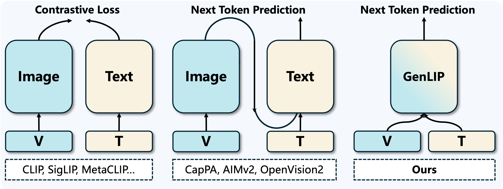

# GenLIP (Learning Fork)

This repository is a **fork** of the original GenLIP codebase, kept primarily to **understand how the training “world” works end-to-end** (configs → dataloading → training scripts → checkpoints).

- Upstream project/paper: https://arxiv.org/abs/2605.00809
- Upstream code: https://github.com/YanFangCS/GenLIP

<div align="center">
  
</div>

## Setup

### 1) Install

```bash
git clone <your-fork-url>
cd GenLIP

python -m pip install -r requirements.txt
python -m pip install -e .
```

If you are using **PyTorch >= 2.6.0**, you may need to install **ByteCheckpoint** manually (the upstream note still applies):

```bash
git clone https://github.com/ByteDance-Seed/ByteCheckpoint.git
cd ByteCheckpoint
python -m pip install -e .
```

### 2) Configure datasets

Training configs live under `configs/pretrain/`. Before launching a run, update:

- dataset paths in the YAML (`data.*`)
- output directory (`train.output_dir`)
- model config path (`model.config_path`) if you move configs

## Usage

### Train (single node)

```bash
bash jobs/train.sh <main_func> <train_config>

# Stage 1 example:
bash jobs/train.sh tasks/train_genlip_stage1.py configs/pretrain/genlip/stage1/train_genlip_so16_224_recap.yaml

# Stage 2 example:
bash jobs/train.sh tasks/train_genlip_navit.py configs/pretrain/genlip/stage2/train_genlip_so16_navit.yaml
```

### Train (multi-node)

- `jobs/train_multinode.sh` for torchrun-based multi-node
- `jobs/train_slurm_mutlinode.sh` for Slurm clusters

## Inference (Quickstart)

This fork includes a lightweight single-image inference utility under `genlip_infer/` plus a small CLI in `scripts/infer.py`.

### 1) Create an inference config (YAML)

The CLI expects a YAML config with at least `model.config_path` pointing to a model config directory or config JSON.

```yaml
# configs/infer_example.yaml
model:
  config_path: /path/to/model_config_or_dir

infer:
  prompt: "Describe this image. <|vision_start|><|image_pad|><|vision_end|>"
  max_new_tokens: 128
  temperature: 0.2
  top_p: 0.9
```

### 2) Run via CLI

```bash
python scripts/infer.py \
  --image assets/teaser.png \
  --checkpoint /path/to/checkpoint_or_hf_weights_dir \
  --config configs/infer_example.yaml \
  --device cpu \
  --dtype fp32 \
  --json
```

### 3) Run via Python

```python
from genlip_infer import InferencePipeline, load_inference_config

cfg = load_inference_config("configs/infer_example.yaml")
pipe = InferencePipeline(cfg, device="cpu", dtype="fp32")
result = pipe.run(
    image_path="assets/teaser.png",
    checkpoint_path="/path/to/checkpoint_or_hf_weights_dir",
)
print(result.get("generated_text", ""))
```

### 4) Web demo (Gradio)

```bash
python web/app.py
```

## Tests (Cómo ejecutar una prueba)

The repository test suite lives under `tests/` and is runnable with the Python standard library:

```bash
python -m unittest discover -s tests -p "test_*.py" -q
```

Run a single test file (example):

```bash
python -m unittest tests.test_cli_args -v
```

Notes:
- `tests/test_checkpoint.py` and `tests/test_preprocessing.py` are skipped unless `torch/torchvision/Pillow` are installed.
- If you want the optional dev tools from `pyproject.toml`, install them with `python -m pip install -e ".[dev]"` (enables `pytest`/`ruff`).

## Model checkpoints

Pretrained checkpoints from the upstream release are on HuggingFace:
https://huggingface.co/collections/YanFang/genlip

## License

Apache-2.0 (see `LICENSE`).
